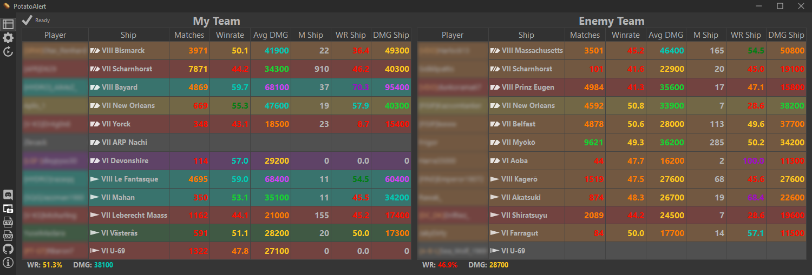
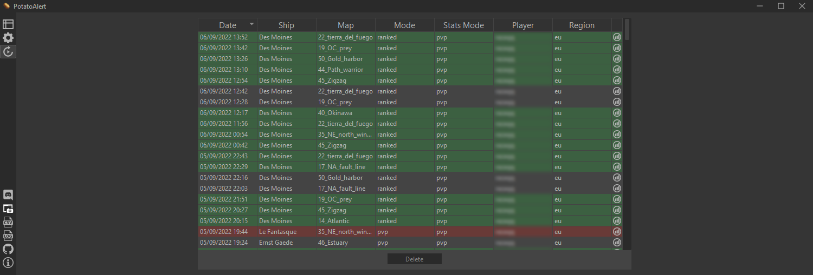
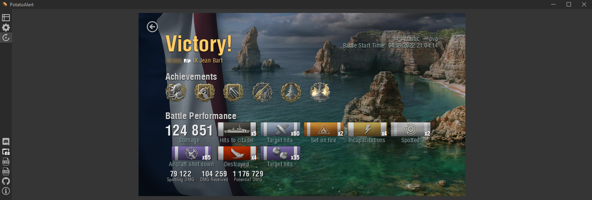

# PotatoAlert

[](https://github.com/razaqq/PotatoAlert/releases) 
[](https://github.com/razaqq/PotatoAlert/releases)
[](https://github.com/razaqq/PotatoAlert/actions/workflows/build.yaml)
[](https://opensource.org/licenses/MIT)
[](https://discord.gg/Ut8t8PA)
[](https://paypal.me/potatoalert)

## Screenshots





## Features

- Fetch stats of current match automatically when your game starts
- Match history to record all played matches
- Replay parser to extract information from replays automatically (into match history)
- Compact layout (either vertical or horizontal), so should easily fit on your second monitor
- Stats and backgrounds (overall personal rating) are colored based on wows-numbers.com
- Double clicking a player will bring open the wows-numbers.com profile
- Support for all game modes, even clan wars with teams from different servers

## Warning

This tool is by no means meant for stat shaming or being toxic towards other players in general.
Please behave yourself in chat.
If you think you cannot follow this simple rule, then you hereby don't have my permission to use this tool.

## Installing

### Windows

Download the [latest Release](https://github.com/razaqq/PotatoAlert/releases/latest), unpack it, start it.

### Linux

If you are on Arch Linux, there exists an [AUR package](https://aur.archlinux.org/packages/potatoalert). If you are on another distro, you have to compile from source.

## Compiling

### Windows

#### Requirements

- [Qt](https://www.qt.io/) >= 6.6.0
- [clang](https://clang.llvm.org/) >= 11.0.0 or MSVC
- [ninja](https://ninja-build.org/) >= 1.10.2
- [cmake](https://cmake.org/) >= 3.17
- [Visual Studio 2022](https://visualstudio.microsoft.com)
- Windows SDK >= 10
- [python](https://www.python.org/) >= 3.7
- [rust](https://www.rust-lang.org/) >= 1.60

#### Steps

- Get Paths
  - Qt6 `-DCMAKE_PREFIX_PATH=C:\Qt\6.6.0\msvc2019_64`
- Add clang to PATH and set `CC` and `CXX` env vars to set clang as compiler
  - `set CC=clang`
  - `set CXX=clang++`
- Call cmake (from x64 Native Tools Command Prompt for VS2022)

```console
cmake -S . -B build -G Ninja -DCMAKE_BUILD_TYPE=Release -DCMAKE_PREFIX_PATH=C:\Qt\6.6.0\msvc2019_64 -DCMAKE_RC_COMPILER=RC
cmake --build build --config Release --target PotatoAlert PotatoUpdater
```

- You find the build output in `.\build\bin\`

### Linux

#### Requirements

- [Qt](https://www.qt.io/) >= 6.6.0
- [gcc](https://clang.llvm.org/) >= 12
- [ninja](https://ninja-build.org/) >= 1.10.2
- [cmake](https://cmake.org/) >= 3.17
- [python](https://www.python.org/) >= 3.7
- [rust](https://www.rust-lang.org/) >= 1.60
- openssl

#### Steps

```console
cmake -S . -B build -G Ninja -DCMAKE_BUILD_TYPE=Release
cmake --build build --config Release --target PotatoAlert
```
